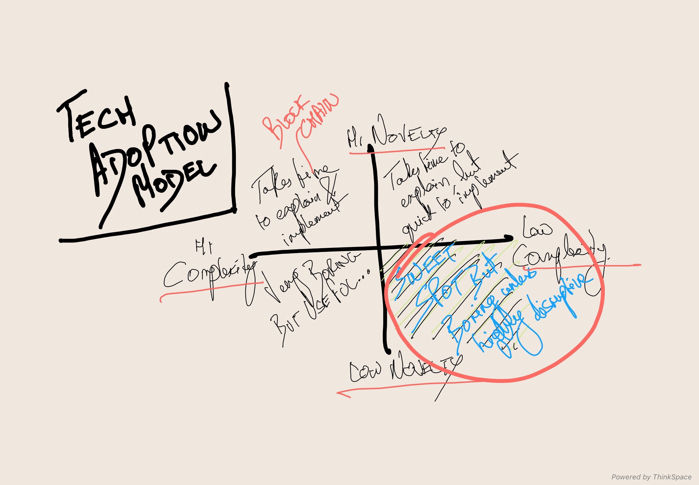

#blockchain #techsignal #Futurism #fssignal
#technology
- Blockchain is foundational not disruptive, it’ll take a long time to replace technology
- Open ledger: Every transaction, agreement, process, payment has a digital record and signature,  that can be identified,  validated, stored and shared
- Cuts through the bureaucracy and makes intermediates unnecessary - seamless,  frictionless transactions between individuals, orgs, machines and algos

**Orgs Today**
- Every org maintains individual records - not always in a central manner
- They are often distributed amongst individual units
- The problem is that collating this across units can be a huge problem 
- In stock trades, while the trade can happen instantaneously, the record upgradation can take ages because their individual ledgers don’t talk to each other
- In blockchain the ledgers are replicated in multiple places and any change is updated simultaneously in real time

